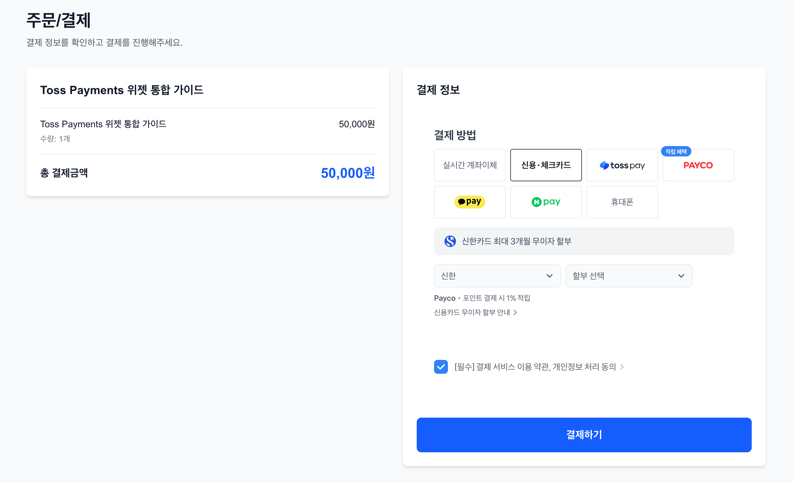

# Toss Payments Integration

Next.js 16 + React 19 기반 Toss Payments Widget SDK 통합 프로젝트입니다.

## 프로젝트 소개

이 프로젝트는 Toss Payments의 결제 위젯을 Next.js 애플리케이션에 통합하는 방법을 보여주는 학습용 프로젝트입니다. TDD (Test-Driven Development) 방법론을 적용하여 개발되었습니다.

### 주요 기능

- 🎨 Toss Payments Widget SDK 통합
- 💳 다양한 결제 수단 지원 (카드, 간편결제, 계좌이체)
- 🔒 서버 사이드 결제 검증
- 🧪 Jest + Playwright 기반 테스트
- ⚡ Next.js 16 + Turbopack
- 🎯 TypeScript 타입 안정성

## 스크린샷

### 결제 페이지



## 시작하기

### 환경 변수 설정

`.env.local` 파일을 생성하고 다음 환경 변수를 설정하세요:

```bash
# Toss Payments API Keys
NEXT_PUBLIC_TOSS_CLIENT_KEY=test_gck_docs_Ovk5rk1EwkEbP0W43n07xlzm
TOSS_SECRET_KEY=test_gsk_docs_OaPz8L5KdmQXkzRz3y47BMw6

# Application URL
NEXT_PUBLIC_BASE_URL=http://localhost:3000
```

### 개발 서버 실행

```bash
# 의존성 설치
npm install

# 개발 서버 시작
npm run dev
```

브라우저에서 [http://localhost:3000](http://localhost:3000)을 열어 결제 페이지를 확인하세요.

### 빌드 및 배포

```bash
# 프로덕션 빌드
npm run build

# 프로덕션 서버 시작
npm start
```

## 테스트

```bash
# 단위 테스트
npm test

# 테스트 watch 모드
npm run test:watch

# 커버리지 리포트
npm run test:coverage

# E2E 테스트
npm run test:e2e

# E2E 테스트 UI 모드
npm run test:e2e:ui
```

## 프로젝트 구조

```
toss-integration/
├── app/                      # Next.js App Router
│   ├── api/                  # API Routes
│   │   ├── orders/          # 주문 생성 API
│   │   ├── payments/        # 결제 검증 API
│   │   └── webhooks/        # 웹훅 핸들러
│   ├── checkout/            # 결제 페이지
│   ├── success/             # 결제 성공 페이지
│   └── fail/                # 결제 실패 페이지
├── components/              # React 컴포넌트
│   ├── PaymentWidget.tsx   # 결제 위젯 컴포넌트
│   ├── OrderSummary.tsx    # 주문 요약
│   └── ...
├── lib/                     # 유틸리티 함수
│   └── tossPayments.ts     # Toss SDK 초기화
├── config/                  # 설정 파일
│   ├── constants.ts        # 클라이언트 상수
│   └── server-config.ts    # 서버 전용 설정
├── __tests__/              # 테스트 파일
└── docs/                   # 문서
```

## 주요 기술 스택

- **프레임워크**: Next.js 16 (App Router)
- **UI 라이브러리**: React 19
- **언어**: TypeScript 5
- **스타일링**: Tailwind CSS 4
- **결제**: Toss Payments SDK
- **테스팅**: Jest, Testing Library, Playwright
- **번들러**: Turbopack

## 문서

- [CLAUDE.md](CLAUDE.md) - Claude Code 작업 가이드
- [CODE_REVIEW.md](docs/CODE_REVIEW.md) - 코드 리뷰 및 보안 체크
- [TEST_GUIDE.md](docs/TEST_GUIDE.md) - 테스트 가이드
- [프로젝트 계획](docs/toss-integration/README.md) - 전체 프로젝트 계획 및 실행 가이드

## 보안 주의사항

⚠️ **중요**: 이 프로젝트는 테스트/학습용입니다.

프로덕션 배포 전 반드시 확인하세요:

1. ✅ 테스트 API 키를 실제 키로 교체
2. ✅ `TOSS_SECRET_KEY`가 서버 사이드에서만 사용되는지 확인
3. ✅ 결제 금액 및 주문 정보를 서버에서 검증
4. ✅ 데이터베이스 연동 (현재 미구현)
5. ✅ 보안 감사 수행

자세한 내용은 [CODE_REVIEW.md](docs/CODE_REVIEW.md)를 참조하세요.

## 라이선스

MIT

## 참고 자료

- [Toss Payments 개발자 문서](https://docs.tosspayments.com/)
- [Next.js 문서](https://nextjs.org/docs)
- [Widget SDK 레퍼런스](https://docs.tosspayments.com/reference/widget-sdk)
